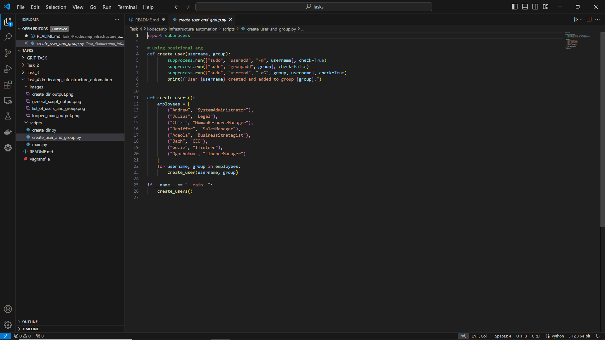
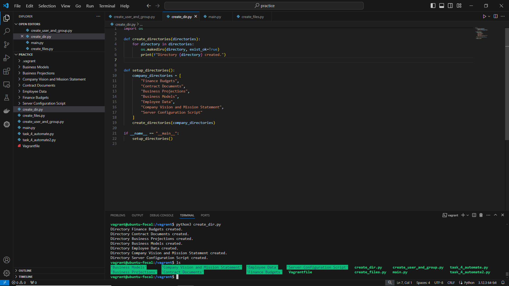
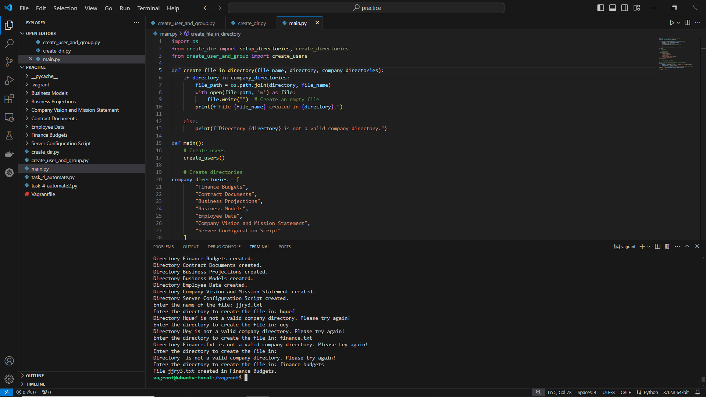
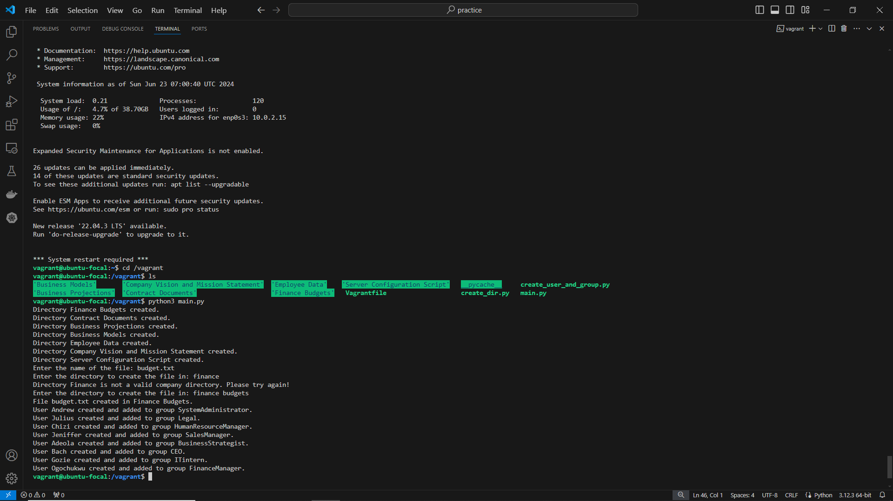

# Kodecamp infrastructure automation

This is a breakdown of the steps I took to set up the infrastructure servers of kodecamp company.

### 1. Using Python, create the following users, and assign them to groups

- I wrote a python script/module using the built-in  subprocess module to automate the creation of groups on a linux environment. The module provides a function which creates a list of users and assign them to various groups which are provided using positional argument. 

### 2. Using Python, create the following directories

I wrote a python script/module using the built-in os, which provides functions to interact with the operating system(os), such as creating directories and handling file paths. It provides the function `create_directories` which handles the actual creation of directories, ensuring they are created if they don't already exist.
And also provides the function setup_directories which lists the specific directories to be created and calls `create_directories` with this list.

### 3. Include a feature that takes user input and creates a file in your code. User input should include: 
- Name of file
- Directory to create the file
- Don't create the file if the Directory name is not one of the company directories.

I wrote another script using the built-in os and the created(create_user_and_group and create_dir) modules which provides the `create_file_in_directory` function that is responsible for creating a file in a valid company directory. Then, i used a main function to call create users, setup directories, prompt the user for a file name and a valid directory to create the file in, ensure the directory is valid before creating the file, and a loop to keep iterating until a valid directory is entered by the user.

## Final Output
When the scripts are run all together here is the output.

